# Como evoluir o código
[Voltar](../README.md)

Assumindo que o projeto foi devidamente instalado ([ler sobre sobre instalação](instalacao.md)) seguem alguns tópicos referentes a como evoluir o código do projeto.
## 1. Utilizando o MDA

Todas as entidades da aplicação estão localizadas na pasta raiz **[xmls](../xmls/)** em formato **.xml**.

Estes arquivos contém todas as especificações da entidade, dentre elas: seus atributos, construtores, objeto de resposta, formulário e ações.

Ao escrever uma nova entidade preste atenção nos seguintes pontos:

Nesta sessão é onde são colocadas os atributos da entidade.
Note que existem propriedades específicas para definir o tipo, nome da coluna, se é um id entre outros.

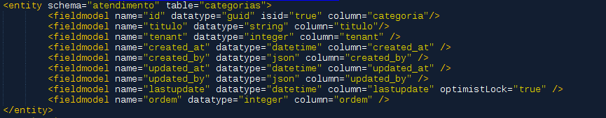

Nesta sessão é onde são definidos os construtores(ou filtros) que o desenvolvedor poderá fazer ao listar os itens cadastrados na entidade.
Na imagem abaixo o único filtro disponível é o Tenant.

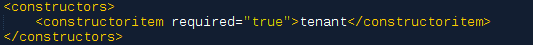

Na sessão abaixo será definido a estrutura do objeto que será enviado ao usuário quando o mesmo estiver visualizando um dos itens desta entidade.

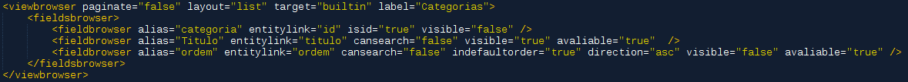

Abaixo temos a sessão do formulário, nela podemos construir todo nosso front-end a partir do que for descrito no XML.

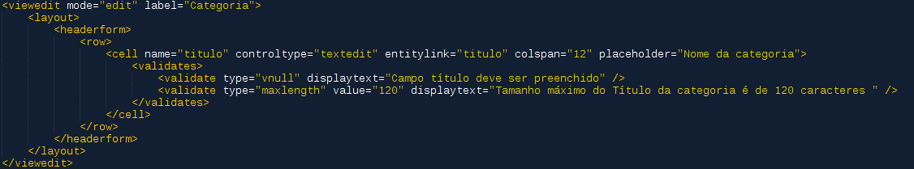

E por ultimo as ações que teremos com relação a esta entidade. Dentre essas ações as mais comuns são: Insert, Update e Delete, mas é possível adicionar ações personalizadas para a sua entidade.

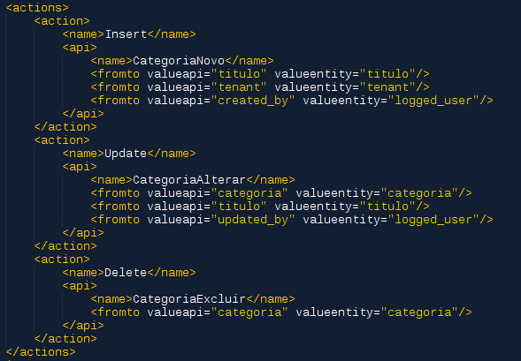

**IMPORTANTE**: Para mais informações sobre o MDA leia a [documentação completa](https://docs.google.com/document/d/1y8Xo4zDjRnTa8I-clCwBE3mP4Iv4ksol8gkAJMPYJ5A/edit?usp=sharing)

**Após a criação ou edição** do arquivo é necessário gerar suas classes a partir do que foi descrito no XML.

Para gerar execute o transformer com o comando abaixo:
``` bash
 docker-compose up php-node
```

## 2. Estendendo o MDA

Dependendo do que foi descrito no seu XML o transformer irá gerar classes de **Controller**, **Service** e **Repository** e também os itens referentes ao seu front-end.

Após executar o transformer da entidade categoria os seguintes itens são gerados:

Controller

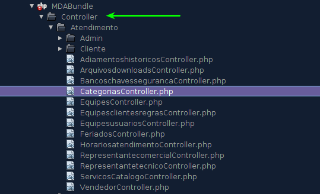

Repository

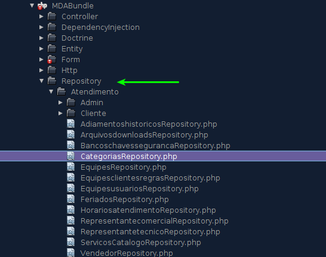

Resources

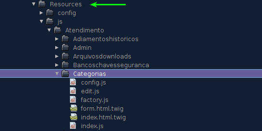

Se um dos médotos gerados não for seguido de forma padrão você pode estende-lo e alterar seu comportamento.

Para fazer isto crie a classe que deseja alterar o comportamento no seu projeto. 
Como por exemplo o Repository.

Crie sua classe Repository

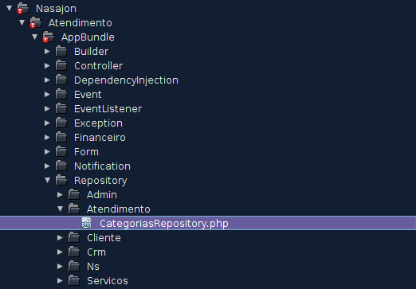

Declare que sua classe está estendendo uma classe Repository já existente

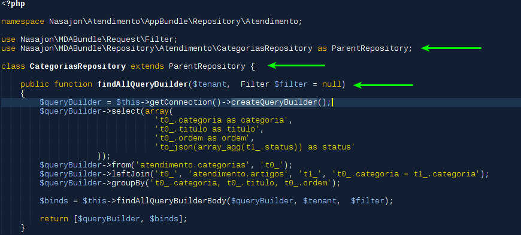

Registre sua classe Repository que está estendendo a original

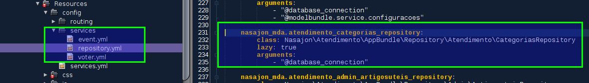

## 3. Testes
## 4. Boas práticas