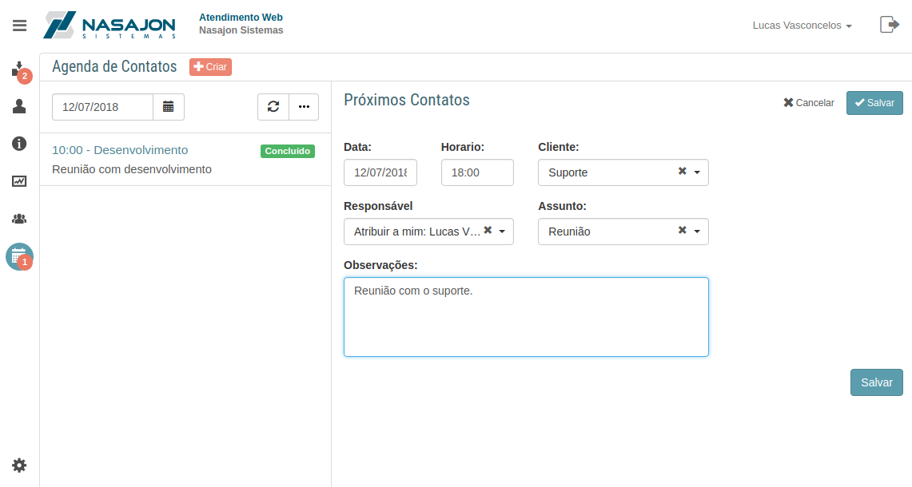
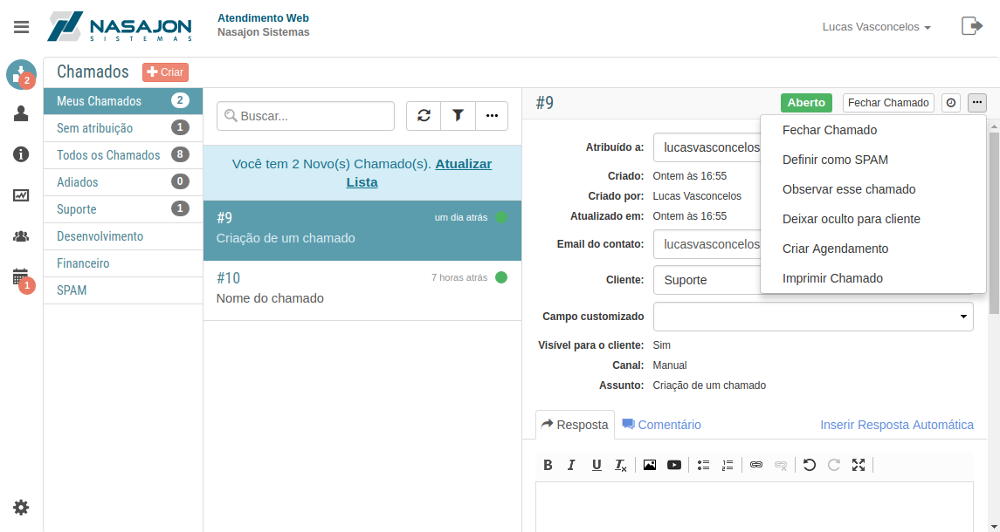
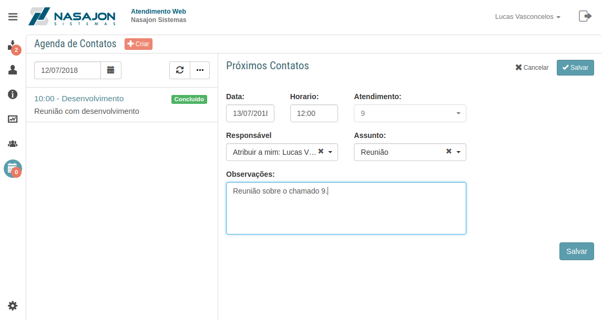
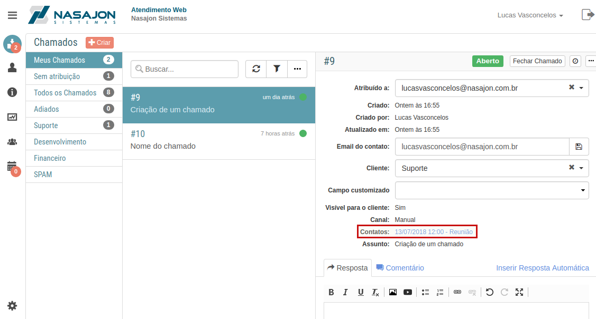

# Agenda de Contatos
[Voltar](../../../../README.md)

A agenda de contatos funciona como um calendário de compromissos com os seus clientes. Nela você pode marcar compromissos com data e hora vinculados ou não a um cliente(dependendo do que foi configurado).

## Criando um agendamento vinculado a um chamado

É possível também criar um agendamento vinculado a um chamado. Para fazer isto vá até a pagina de chamados e clique em "Criar agendamento" como mostra a imagem abaixo

Perceba que ao fazer isto o formulário irá alterar o cadastro de cliente pelo número do chamado

E isto também ficará registrado no chamado

