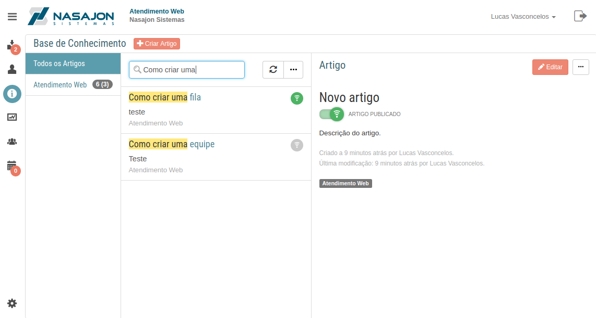

# Base de Conhecimento
[Voltar](../../../../README.md)

A base de conhecimento guarda todos os artigos criados pelos atendentes categorizando-os de acordo com o que foi criado nas configurações do atendimento web.

Através destes artigos é possível:

* Responder chamados para auxiliar os clientes
* Evitar a criação de chamados quando um cliente busca alguma informação, dúvida ou tenta criar um chamado
* Verificar se aquele artigo está ajudando ou não os clientes com a funcionalidade de curtir/descutir de artigos.
* Publica-los para ficarem visíveis aos clientes ou mante-los como rascunho para efetuar algum ajuste.
* Fixa-los no topo para que os artigos mais importantes tenham uma visibilidade muito maior.

## Formulário de Artigos

## Publicação de Artigos

## Fixar artigos no topo

## Busca de artigos

A busca de artigos utiliza hoje o Full Text Search Rank do PostgreSQL. Isso quer dizer que dependendo do que for buscado na listagem de artigos ele irá criar um ranqueamento dos artigos mais prováveis de acordo com a sua pesquisa.

### Exemplo de busca "Como criar uma"

O resultado desta busca lista somente 2 artigos que estão na imagem abaixo:

### Exemplo de busca "Como criar uma f"

Note que agora a busca excluiu um dos itens porque não tem relevancia com o novo texto que foi pesquisado

