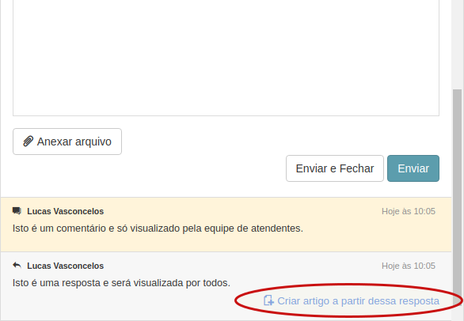
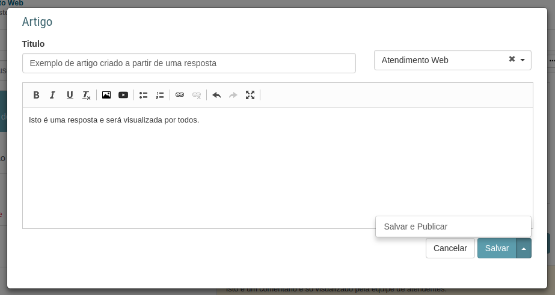

# Criar artigo através de uma resposta
[Voltar](../../../../README.md)

Ao responder um chamado o atendente pode ter criado uma resposta tão elaborada que pode ser válido criar um artigo através daquela resposta.

No histórico do chamado onde a resposta do atendente pode ser visualizada, existe um link que ao ser clicado abre uma modal para cadastrar um artigo.

## Link para criar o artigo

## Modal de criação de artigos

Após clicar em salvar ou em salvar e publicar o artigo será criado e poderá ser visualizado lá na base de conhecimento.

------------

[< Enviando uma resposta e um comentário interno](followups.md) - [Enviando um artigo como resposta >](respostaartigo.md)