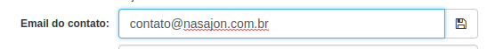

# Criando e Alterando um chamado
[Voltar](../../../../README.md)

Para criar ou ser atribuído a um chamado é necessário ser integrante de uma equipe como foi dito anteriormente em Configurações Gerais.

Para criar um chamado basta preencher o formulário abaixo com os seguintes itens:

* Cliente: O cliente que solicitou o suporte.
* E-mail de Contato: Um dos usuários do cliente que será notificado da criação do chamado e das atualizações do mesmo.
* Atribuir a: Atendente responsável pelo chamado.
* Visível para o cliente: Se este chamado ficará visível ou não para o cliente. (Valor padrão pode ser configurado em Configurações Gerais).
* Campos customizados: Campos cadastrados em configurações (podem ou não ser obrigatórios).
* Assunto: Descrição curta ou resumo do chamado (Campo pode ser habilitado ou desabilitado em Configurações Gerais)
* Resposta: Descrição longa

## Formulário

Após o cadastro do chamado ele será direcionado para a fila do usuário ou fila ao qual foi atribuído e também ficará disponível em "Todos os chamados".

Um e-mail também será enviado para todos os observadores do chamado exceto do seu criador, ou seja, neste momento o único que recebe é o contato do cliente.

## Criando chamados por e-mail

O Atendimento Web também nos permite a criação de chamados por e-mail. Para isto, basta enviar uma mensagem para um dos e-mails cadastrados lá em configurações e seu chamado será criado.

------------

Após a criação do chamado podemos alterar diversas informações do mesmo. Segue abaixo a lista de itens que podem ser alterados:

## Alterar atribuição

Trocar a atribuição para outro usuário com equipe, para uma fila ou remover a atribuição.

## Alterar e-mail do contato

Alterar o e-mail do contato.

## Alterar cliente

Alterar ou remover o cliente deste chamado.

## Alterar campos customizados

Alterar o valor dos campos customizados.

## Fechar/Reabrir chamado

Alterar a situação do chamado para fechado. (obs: O cliente não sabe da existência desta situação para ele o chamado continuará disponível para enviar uma resposta.)

## Definir como/Remover de SPAM

Altera a situação do chamado para SPAM e o envia para caixa do mesmo.

## Deixar de Observar chamado

Vira um observador do chamado, ou seja, toda alteração, resposta etc será enviada por e-mail.

## Deixar oculto/ visível para o cliente

Ocultar e habilitar a vibilidade do chamado para o cliente

## Criar agendamento

Criar um contato na agenda de contatos para este chamado.

## Adiar chamado

Para adiar um chamado o mesmo precisa estar atribuído a você. 

Após escolher a data e adia-lo o mesmo sairá da sua caixa de chamados e irá para de Adiados, porém o tempo dele continuará sendo contado normalmente nos relatórios.

Caso a atribuição deste chamado seja alterada ou removida o mesmo deixa de estar adiado.

## Atalhos de teclado

Todas essas alterações citadas acima geram um histórico no chamado que foi alterado. Como mostra o chamado abaixo:

------------

[Enviando uma resposta e um comentário interno >](followups.md)