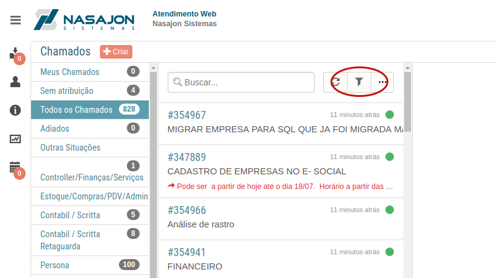
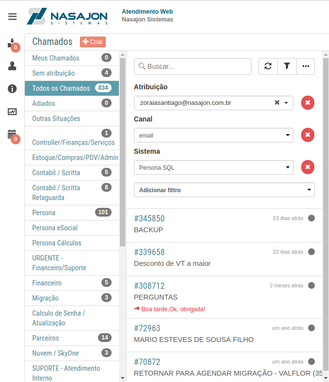

# Usando o filtro avançado
[Voltar](../../../../README.md)

Para buscar um chamado ou vários chamados dentro de um filtro específico é possível faze-lo como nas imagens abaixo.

## Filtro avançado de chamados

É possível adicionar diversos filtros como mostra a imagem abaixo até chegar ao resultado esperado.

Cada filtro adicionado faz com que a URL seja alterada, permitindo que os usuários compartilhem seus filtros ou que salvem essas URL's nos favoritos de seus navegadores.

------------

[< Enviando um artigo como resposta](respostaartigo.md)