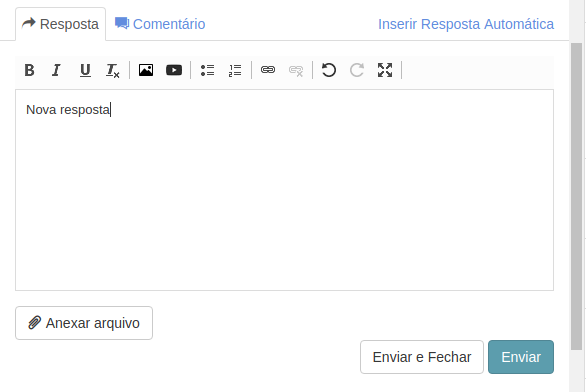
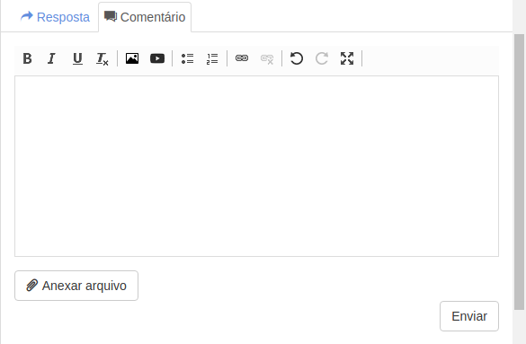
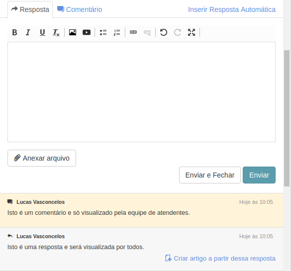

# Enviando uma resposta e um comentário interno
[Voltar](../../../../README.md)

Existem 2 tipos de respostas:

* Resposta - Representam a troca de informações entre cliente e atendente sobre o tema do chamado.
* Comentário - Mensagens internas que são invisíveis ao cliente.

## Criando uma resposta

O componente utilizado para adicionar respostas ao chamado é um WYSIWYG chamado CKEditor, ele nos permite personalizar a nossa resposta, adicionar imagens, vídeos entre outras coisas.

Como mostra a imagem abaixo, podemos também anexar arquivos na resposta que posteriormente ficará disponível e visível para todos.

## Criando um comentário

Como foi dito acima existem também mensagens que são trocadas somente entre atendentes e não são visualizadas pelos clientes.

Para enviar um comentário destes basta alterar a aba para Comentário como mostra a imagem abaixo

## Diferença no histórico do chamado entre a resposta e o comentário

------------

[< Criando e Alterando um chamado](chamados.md) - [Criar artigo através de uma resposta >](artigos.md)