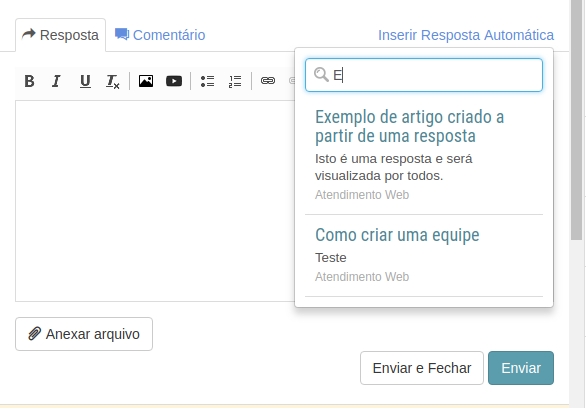

# Enviando um artigo como resposta
[Voltar](../../../../README.md)

É possível também responder um chamado com um artigo.

Note que ao lado das abas de resposta e comentário existe um link "Inserir Resposta Automática" que ao ser clicado abre um campo de busca de artigos.

Após encontrar e clicar no artigo que você deseja enviar ao cliente o mesmo será incorporado no editor de texto e também será incrementado um contador no banco de dados para que seja contabilizado no relatório da base de conhecimento.

------------

[< Criar artigo através de uma resposta](artigos.md) - [Usando o filtro avançado >](filter.md)