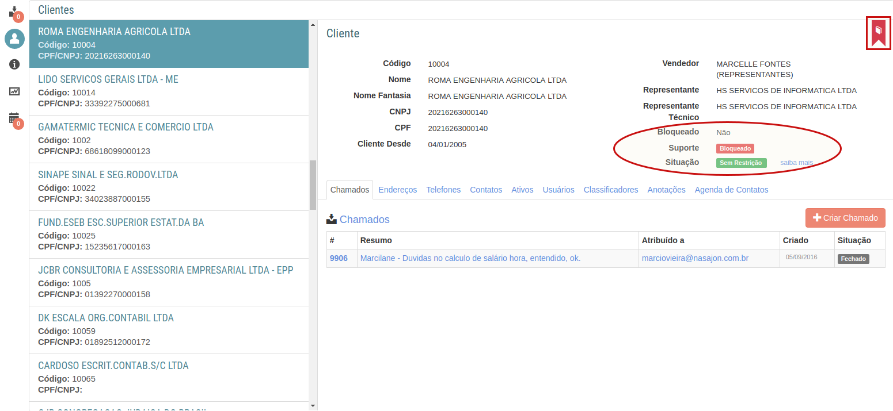

# Clientes
[Voltar](../../../../README.md)

Área destinada a guardar todas as informações pertinentes as clientes que você dá suporte.

Aqui podemos ver as seguintes informações:

* Chamados - Chamados que foram criados pelo cliente
* Endereços - Endereços físicos
* Telefones - Todos os telefones de contato
* Contatos - Outros tipos de contantos
* Ativos - Serviços contratados pelo cliente
* Usuários - Equipe de usuários do cliente que pode solicitar suporte
* Classificadores
* Anotações
* Agenda de contatos - Contatos marcados do cliente

------------

Existe algumas informações que também são importantes e devem ser levadas em consideração. Como mostra a imagem abaixo existe 1 cubo e 1 círculo. O cubo esta demarcando os Avisos de Clientes que foi explanado anteriormente e o círculo marca o status de suporte deste cliente com relação ao Atendimento Web.

