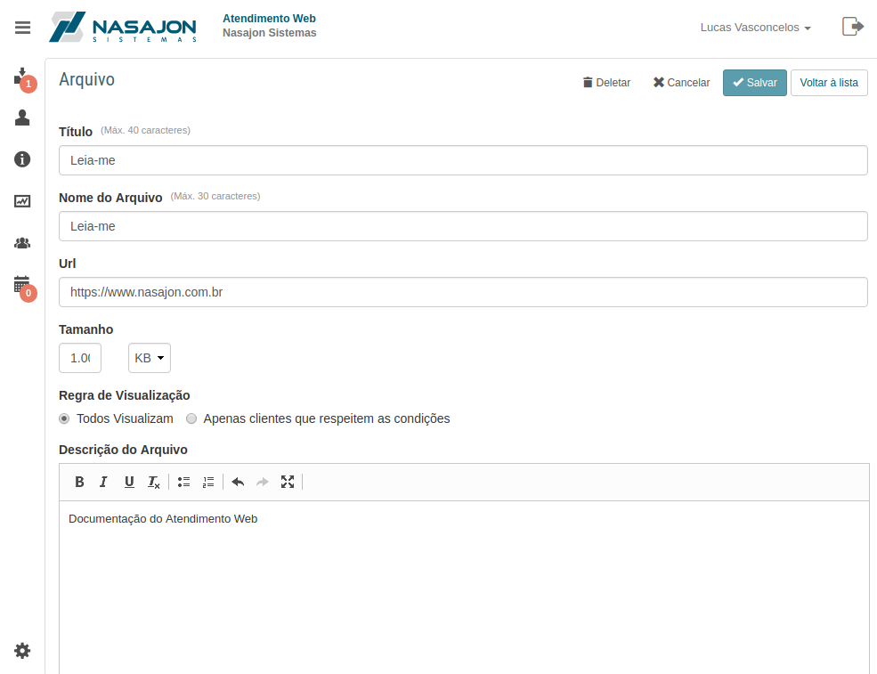
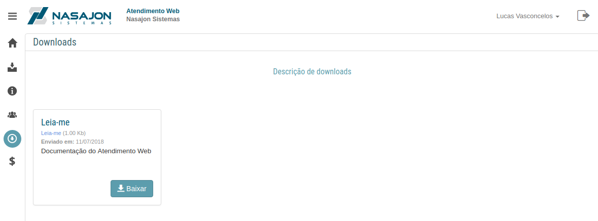

# Arquivos
[Voltar](../../../../README.md)

Sessão destinada a criação, alteração e deleção de arquivos.

Após habilitar o cadastro de arquivos nas [configurações gerais](gerais.md) o módulo de Arquivos é habilitado na listagem de configurações.

Existem condições ao cadastrar o arquivo que permitem a visualização do mesmo por todos os clientes ou só clientes que respeitem as condições configuradas.

Dentre essas condições temos:

* Estado do Cliente
* Serviço Contratado
* Status do Suporte

Nota: Existe uma [configuração geral](gerais.md) "Adicionar regras para download de arquivos" que ao ser configurada, independente do que é configurado no arquivo ela será atendida.

Após cadastrar o arquivo ele ficará disponível para os clientes que estão dentro das condições configuradas

## Formulário

## Lista de arquivos

------------

[< Boletos e faturas](titulos.md) - [Feriados >](feriados.md)