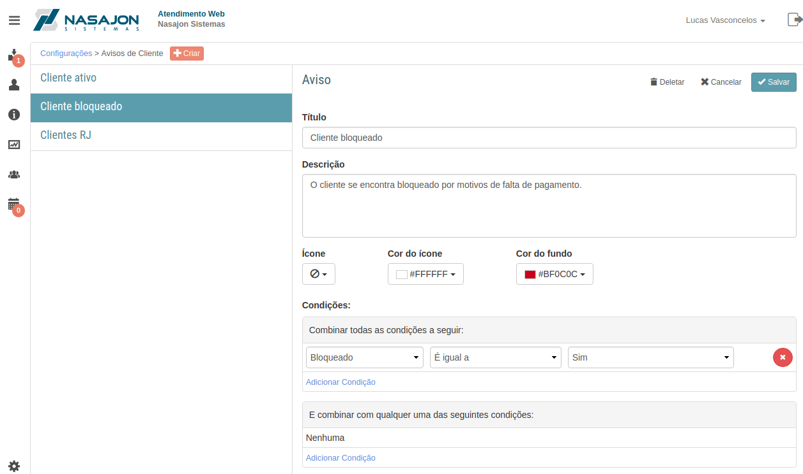
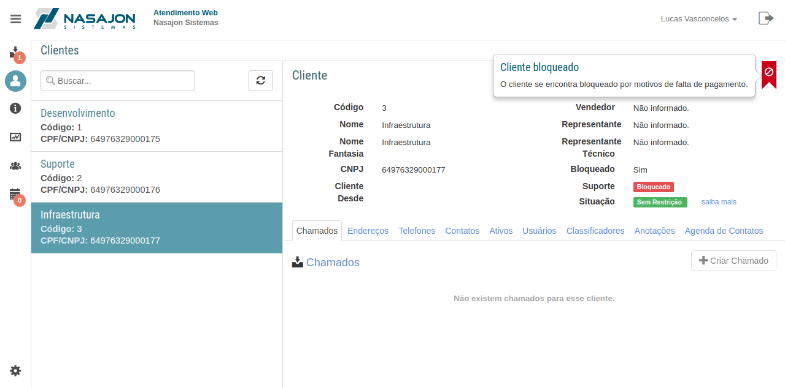

# Avisos de Clientes
[Voltar](../../../../README.md)

Sessão destinada a criação, alteração e deleção de avisos aos clientes cadastrados.

Nesta sessão poderemos cadastrar alguns alertas que ficarão disponíveis para os atendentes ao abrir as informações do cliente.

Através do aviso de clientes é possível:

* Criar avisos para TODOS os clientes.
* Criar avisos para clientes específicos com condições sobre suas informações

-----

Condições possíveis:

* Bloqueado
* Classificadores
* Estado
* Fidelidade
* Representante Comercial
* Representante Técnico
* Serviço Contratado
* Vendedor

## Formulário

## Aviso de Clientes

------------

[< Categorias de artigos](categorias.md) - [Equipes >](equipes.md)