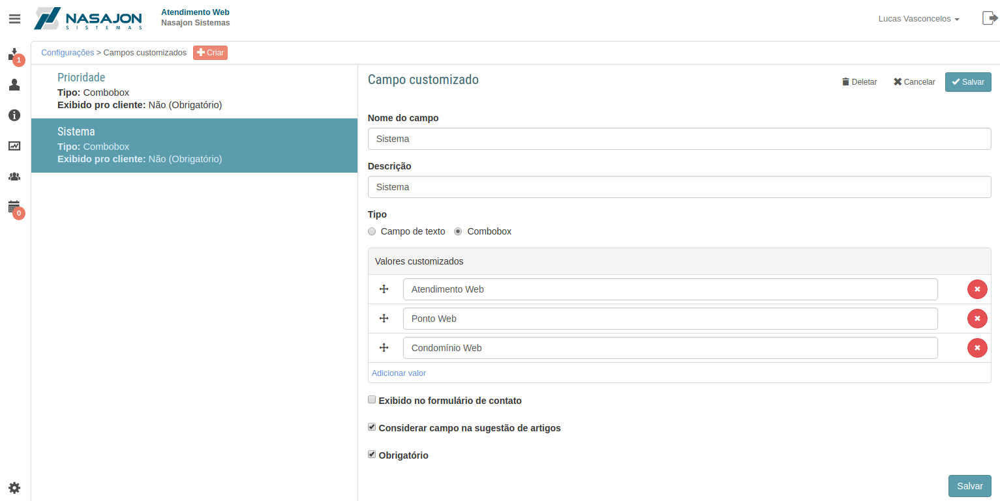

# Campos customizados
[Voltar](../../../../README.md)

Sessão destinada a criação, alteração e deleção de campos customizados.

Os campos customizados são itens de formulário que podem ser criados para obter informações específicas que o cliente tenha necessidade.

Através dos campos customizados é possível:

* Adicionar ao formulário de cadastro de chamados um novo campo personalizado;
* Criar um campo do tipo texto ou lista suspensa;
* Efetuar filtros em todos os relatórios com base nos campos criados;
* Considerar ou não estes campos para auxiliar na sugestão de artigos quando o cliente cria um novo chamado.

------------

[< Filas de chamados](filas.md) - [Regras >](regras.md)