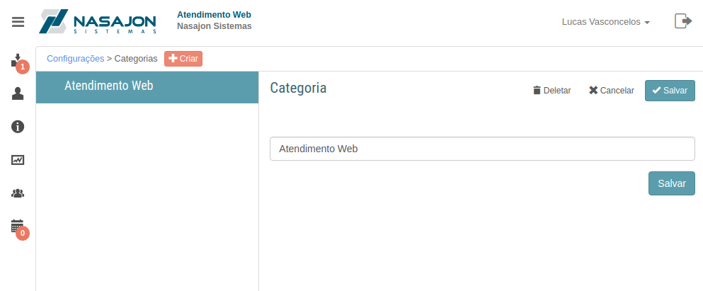

# Categorias de Artigos
[Voltar](../../../../README.md)

Sessão destinada a criação, alteração e deleção de categorias de artigos.

Nesta sessão poderemos cadastrar as categorias de artigos que servem de repositório para artigos do mesmo assunto.

Através das categorias é possível:

* Criar artigos.
* Listar artigos de uma categoria
* Filtrar artigos publicados e rascunho da categoria.

## Formulário

## Categorias de artigos

------------

[< Disponibilidade dos Usuários](disponibilidadeusuarios.md) - [Avisos de clientes >](avisosclientes.md)