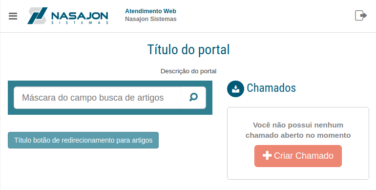
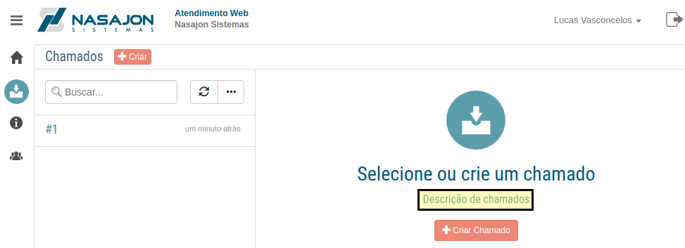
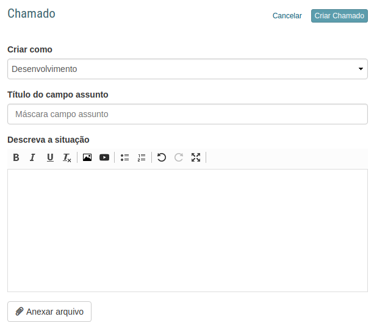
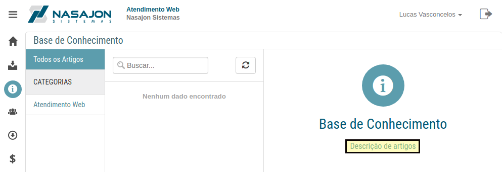
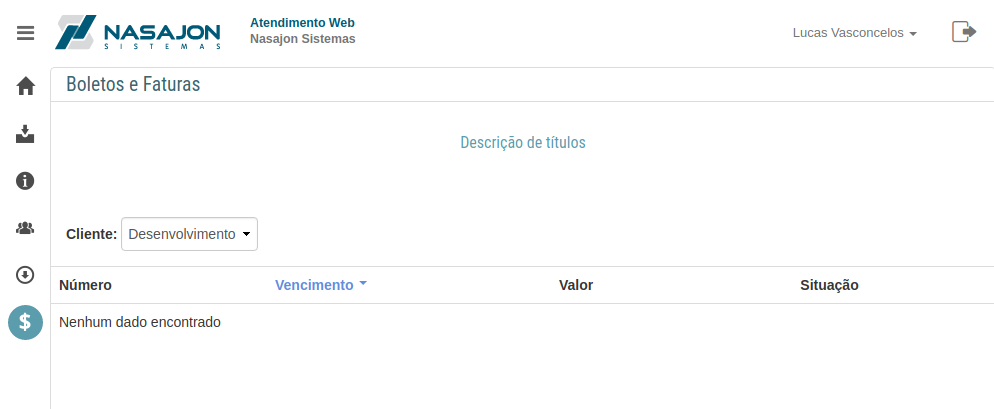
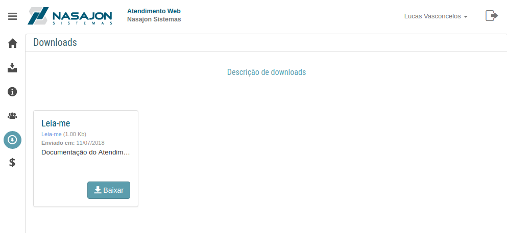

# Customizações
[Voltar](../../../../README.md)

Ao configurar os itens desta sessão o layout da área de clientes será alterado.

## Página inicial

* Título do Portal: Adiciona um título na página inicial.
* Descrição do Portal: Adiciona uma descrição na página inicial.
* Mensagem do campo de busca: Altera o placeholder do campo de busca de artigos na página inicial.
* Botão da base de conhecimento: Altera o título do botão que redireciona o cliente para base de conhecimento na página inicial.

------------

## Chamados

* Descrição de chamados: Adiciona uma descrição na página de chamados.
* Título do campo assunto: Altera o título do campo assunto.
* Mensagem do campo assunto: Altera o placeholder do campo assunto.

*Descrição de chamados*

*Formulário de chamados*

------------

## Artigos

* Descrição de artigos: Adiciona uma descrição na página de artigos.

------------

## Títulos 

* Descrição de títulos: Adiciona uma descrição na página de títulos.

------------

## Downloads

* Descrição de downloads: Adiciona uma descrição na página de downloads.

------------

[< Configurações Gerais](gerais.md) - [Filas de Chamados >](filas.md)