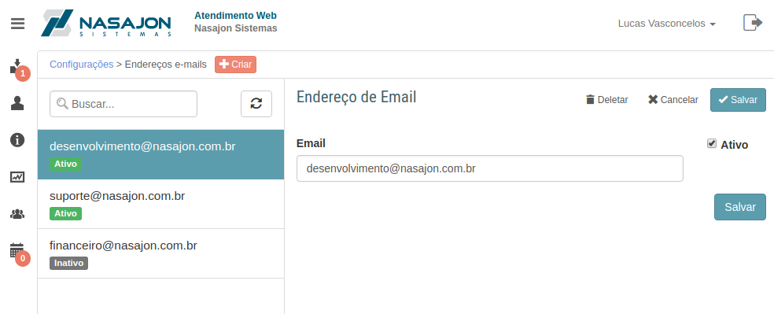

# Endereços de e-mail
[Voltar](../../../../README.md)

Sessão destinada a criação, alteração e deleção de endereços de e-mail.

Os endereços de e-mail são canais que o cliente pode enviar e-mails e automaticamente criar chamados.

Através dos endereços de e-mail é possível:

* Enviar um chamado para uma fila específica;

------------

[< Regras](regras.md) - [Configurações de disponibilidade >](configuracoesdisponibilidade.md)