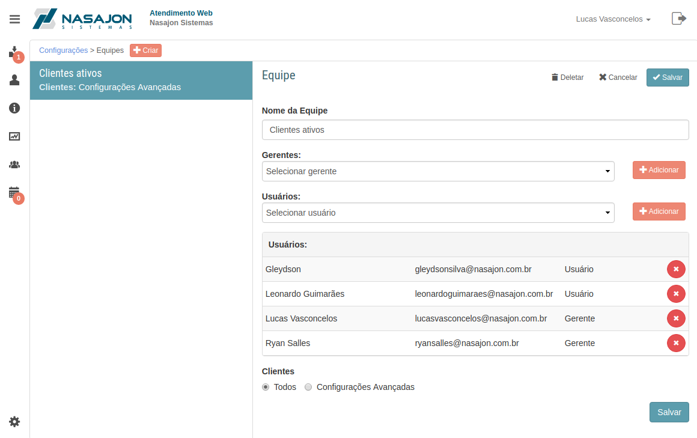

# Equipes
[Voltar](../../../../README.md)

Sessão destinada a criação, alteração e deleção de equipes.

As equipes são destinadas a gerência de todos os clientes ou de clientes dentro de algumas condições que devem ser definidas pelo administrador.

Caso esteja configurado que um atendente sem equipe não pode visualizar chamados e clientes será necessário adicionar o atendente em alguma equipe para que o mesmo possa acessar e criar chamados.

Ao adicionar um atendente como usuário de uma equipe ele só poderá visualizar as informações dos clientes pertinentes a esta equipe e só poderá criar chamados para estes clientes.

Existem duas funções de usuários de equipe o gerente e o usuário. Quando se é gerente é habilitado um novo ícone no menu que permite gerenciar os integrantes da equipe.

Só é permitido que o atendente seja adicionado como função usuário em uma ÚNICA equipe, em contra partida o mesmo atendente pode ser gerente de uma ou mais equipes.

Como foi dito acima as equipes podem gerenciar todos ou clientes que atendem algumas condições, segue abaixo as possíveis condições:

* Bloqueado
* Estado
* Vendedor
* Representante Comercial
* Representante Técnico
* Fidelidade

Através das equipes é possível:

* Criar chamados.
* Visualizar chamados e clientes.
* Filtrar relatórios para visualizar dados de uma das equipes.

------------

[< Avisos de clientes](avisosclientes.md) - [Boletos e faturas >](titulos.md)