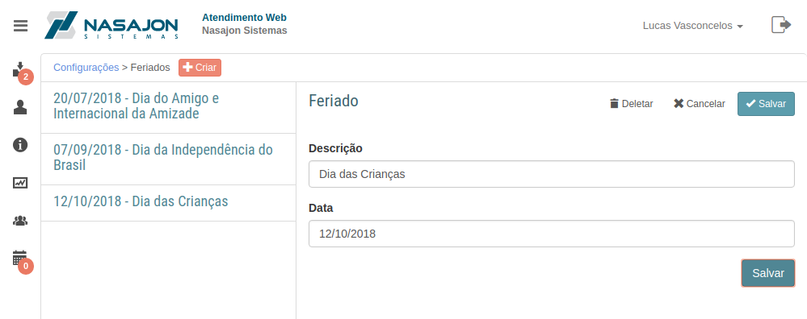

# Feriados
[Voltar](../../../../README.md)

Ao cadastrar um feriado estaremos informando ao nosso cliente que naquela data não haverá Atendimento.

Sendo assim poderão ser criadas regras para que caso o cliente crie um chamado em um feriado, ele seja notificado que só será respondido na próxima hora útil.

## Formulário

------------

[< Arquivos](arquivos.md) - [Horários de Atendimento >](horariosatendimento.md)