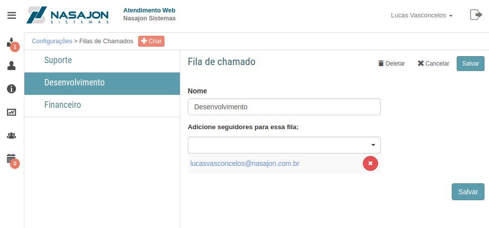

# Filas de Chamados
[Voltar](../../../../README.md)

Sessão destinada a criação, alteração e deleção de filas de chamados.

As filas são repositórios de chamados que estão dependendo de uma resposta daquele setor.

Através das filas é possível:

* Criar regras para que quando um determinado cliente crie um chamado já seja atribuído para uma fila específica;
* Atribuir um chamado a uma fila para que os usuários da fila que são responsaveis respondam o chamado.

------------

[< Customizações](customizacoes.md) - [Campos customizados >](camposcustomizados.md)