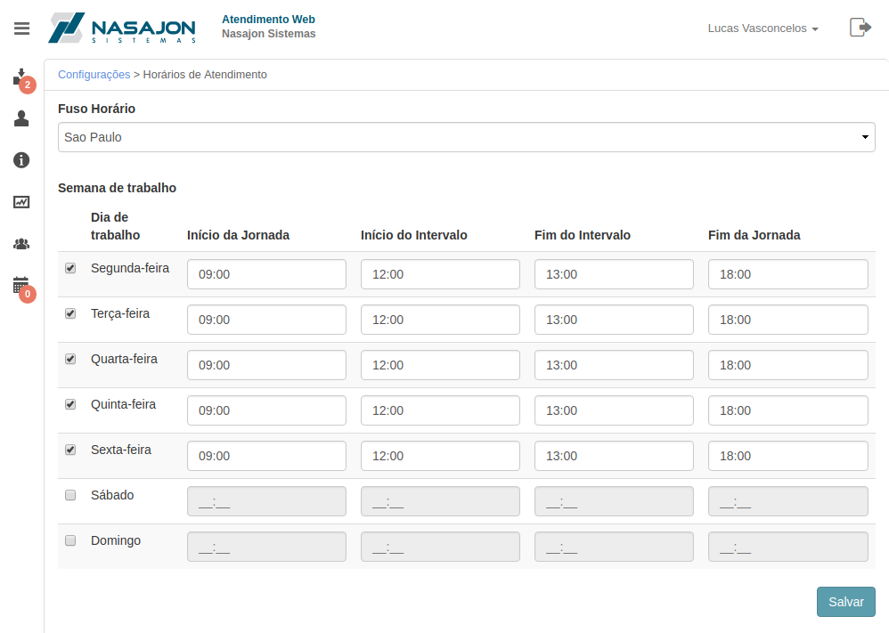

# Horários de Atendimento
[Voltar](../../../../README.md)

Ao configurar os horários de atendimento teremos um controle sobre os dias e horários úteis, ou seja, saber quando o cliente precisa ser respondido com mais agilidade e também poder informa-lo quando o Atendimento Web não está em funcionamento.

## Formulário

------------

[< Feriados](feriados.md)