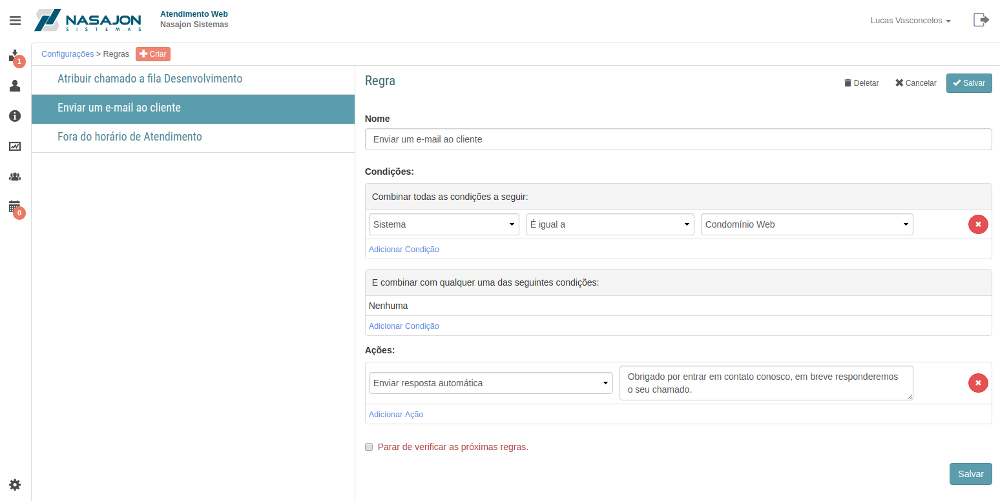

# Regras
[Voltar](../../../../README.md)

Sessão destinada a criação, alteração e deleção de regras.

As regras são compostas de condições e ações. Quando as condições de uma regra são atendidas é executada a ação da mesma.

Condições possíveis na criação de regras:

* Situação
* Sintoma
* E-mail do contato
* Endereço de e-mail
* Representante Comercial
* Representante Técnico
* Status do Suporte
* Campos customizados

De acordo com as condições cadastradas na regras é possível:

* Fechar o chamado automaticamente;
* Enviar o chamado para caixa de SPAM;
* Atribuir a um usuário ou fila específico;
* Enviar um e-mail para o criador do chamado;
* Alterar o valor de um campo customizado.

------------

[< Campos customizados](camposcustomizados.md) - [Endereços de e-mail >](enderecosemail.md)