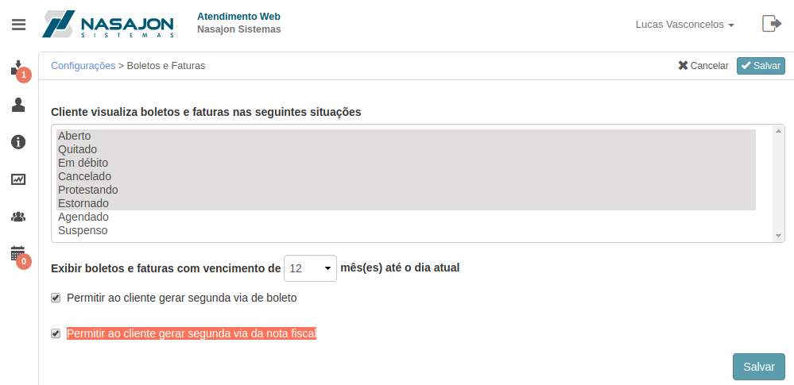
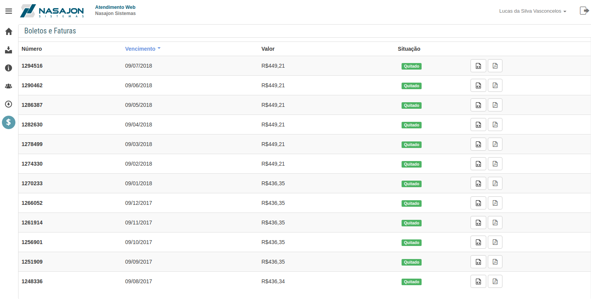

# Boletos e Faturas
[Voltar](../../../../README.md)

Sessão destinada configuração de boletos e faturas.

* Cliente visualiza boletos e faturas nas seguintes situações - Podemos selecionar demarcando quais as situações de boletos e faturas queremos que fiquem disponíveis aos clientes.
* Exibir boletos e faturas com vencimento de X mês(es) até o dia atual - Podemos selecionar o período que deixaremos os itens disponíveis.
* Permitir ao cliente gerar segunda via de boleto
* Permitir ao cliente gerar segunda via da nota fiscal

Configurando os itens acima habilitará um ícone no menu lateral do cliente que ao clicar o mesmo irá visualizar uma listagem de boletos e faturas.

Através das configurações de boletos e faturas é possível:

* Permitir que o cliente visualize no Atendimento Web seus boletos e faturas.

## Formulário

## Lista de boletos e faturas

------------

[< Equipes](equipes.md) - [Arquivos >](arquivos.md)