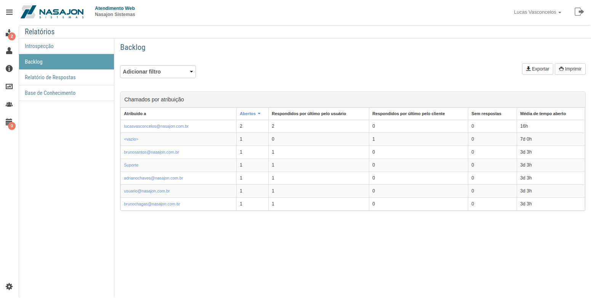

# Relatório de Backlog
[Voltar](../../../../README.md)

O relatório de backlog mostra o cenário atual de quantos chamados estão atribuídos para cada atendente.

------------

[< Relatório de Introspecção](introspeccao.md) - [Relatório de Respostas >](resposta.md)