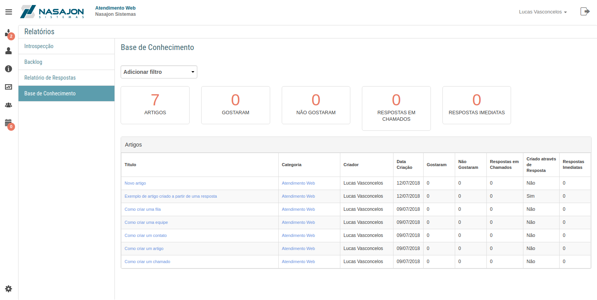

# Relatório da Base de Conhecimento
[Voltar](../../../../README.md)

O relatório da base de conhecimento mostra todos os artigos cadastrados na base de conhecimento. 

Temos também algumas informações importantes como:

* GOSTARAM - Total de curtidas de todos os artigos
* NÃO GOSTARAM - Total de descurtidas de todos os artigos
* RESPOSTAS EM CHAMADOS - Quantas vezes os artigos foram enviados como resposta em chamados
* RESPOSTAS IMEDIATAS - Quantas vezes um cliente deixou de criar um chamado, por conta de um dos artigos sugeridos responder sua dúvida.

------------

[< Relatório de Respostas](resposta.md)