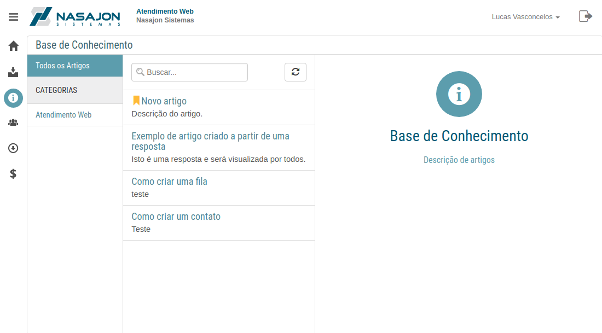
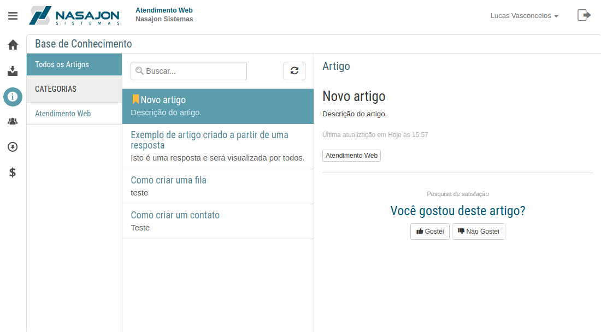

# Base de Conhecimento
[Voltar](../../../README.md)

A base de conhecimento nos mostra todos os artigos publicados pelos atendentes.

Para medir o quão efetivo é um artigo com base na opinião dos clientes, existe uma funcionalidade que permite que o cliente dê uma opinião se gostou ou não gostou do artigo

------------

[< Chamados](chamados.md) - [Usuários >](usuarios.md)