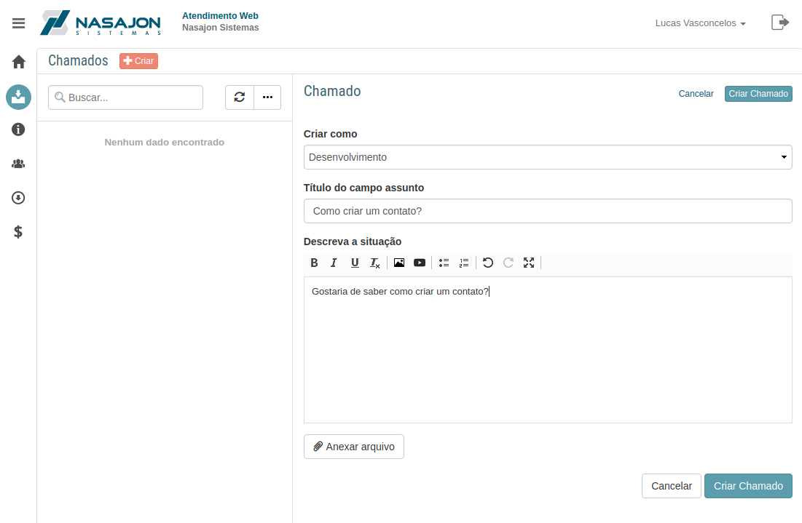
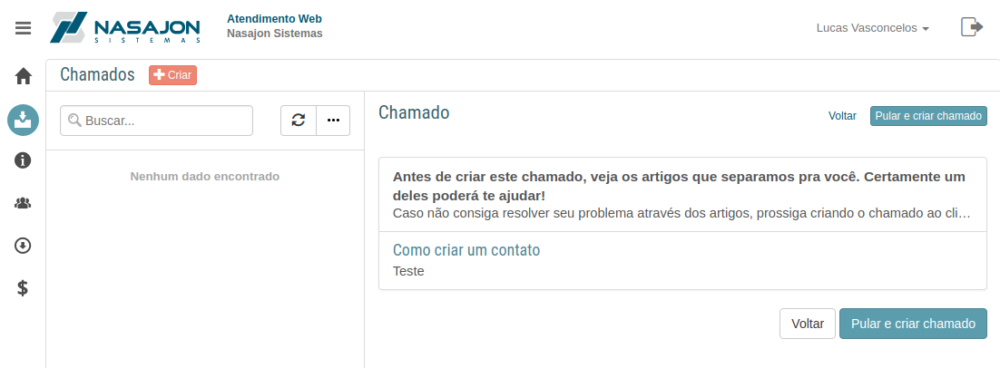
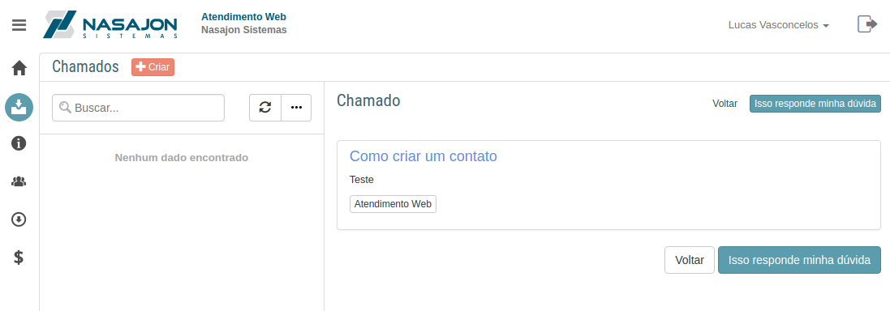
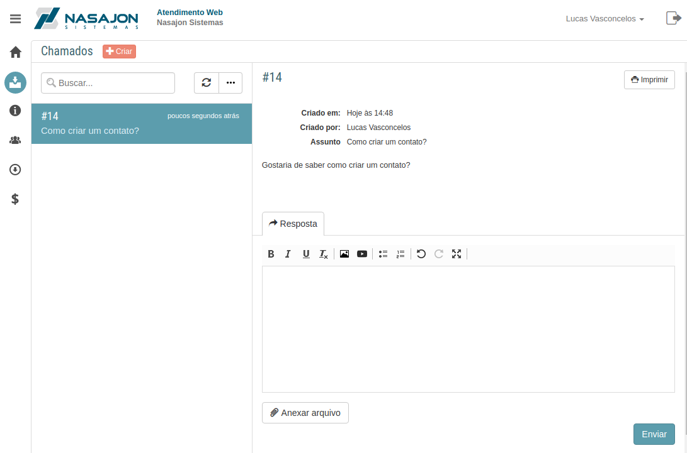

# Chamados
[Voltar](../../../README.md)

Nesta sessão os usuários cadastrados no cliente podem criar chamados para tirar dúvidas, reportar problemas etc.

Caso esteja habilitado nas configurações que os usuários podem criar chamados com a própria conta não será necessário ter um vínculo prévio com cliente para efetuar este cadastro.

## Formulário

Neste formulário você poderá informar o cliente que deseja criar este chamado, caso o cliente dê suporte a mais de um cliente, o assunto do chamado e uma descrição.

## Sugestão de artigos

Ao clicar em criar chamado buscaremos na base de conhecimento para verificar se existe algum artigo com o mesmo tema informado no chamado e mostraremos a lista ranqueada do mais provável para o menos provável.

## Abrindo o artigo sugerido

Clicando no artigo, o cliente poderá visualizar todo conteúdo do artigo e se a sua dúvida for sanada ele poderá sinalizar isto clicando em "Isso responde minha dúvida", caso contrário ele poderá voltar a pagina anterior e escolher outro artigo ou "Pular e criar o chamado".

## Criando o chamado

Ao pular e criar o chamado o resultado estará na imagem abaixo.

------------

[< Página inicial](dashboard.md) - [Base de Conhecimento >](artigos.md)