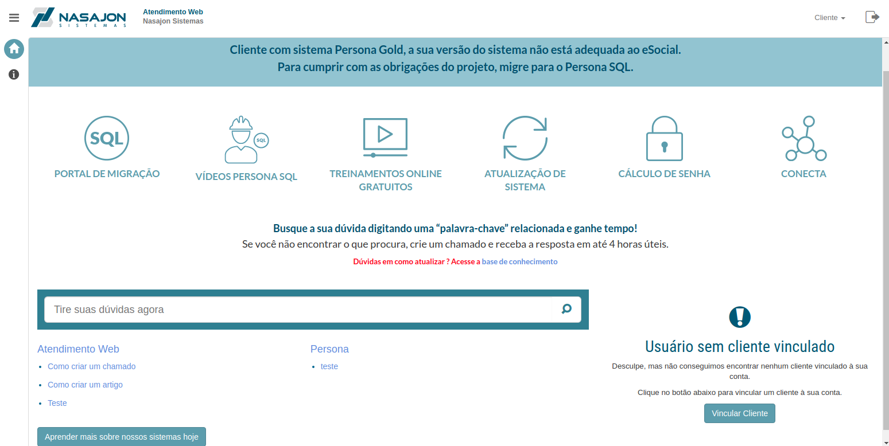

# Página Inicial
[Voltar](../../../README.md)

A página inicial é separada em algumas sessões para auxiliar o cliente a saber o que ele precisa.

Caso o usuário já esteja vinculado a algum cliente ele verá:

* Ao lado direto os chamados que ele ou sua equipe criaram.
* No esquerdo até o meio da tela a busca de artigos na base de conhecimento.
* E por fim ao lado esquerdo abaixo da busca de artigos os artigos da base de conhecimento separados por suas categorias.

Caso o usuário não esteja vinculado a cliente algum ele só verá os itens referentes a base de conhecimento e um item no lado direito chamado "Usuário sem cliente vinculado". Ele serve para enviar um e-mail solicitando a aprovação do usuário para aquele cliente. Para solicitação o usuário precisa informar o CPF ou CNPJ do cliente para que seja enviado o e-mail.

## Usuário com cliente vinculado

## Usuário sem cliente vinculado

------------

[Chamados >](chamados.md)