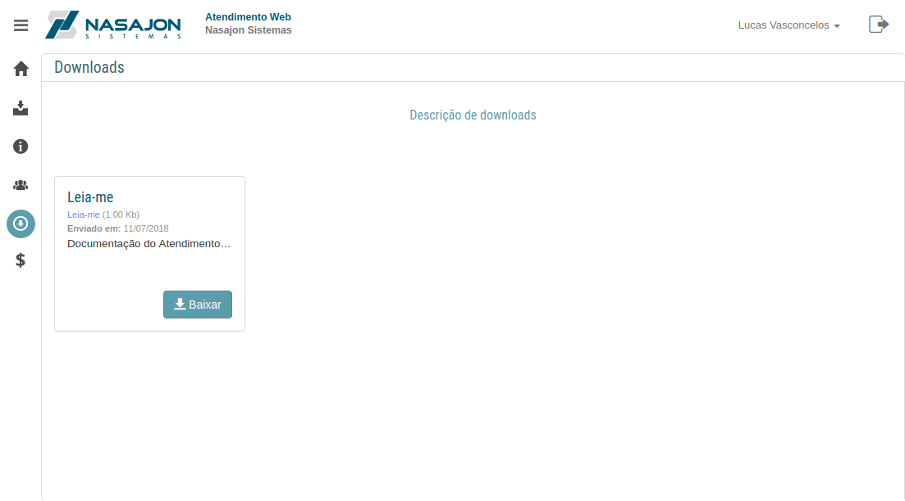

# Downloads
[Voltar](../../../README.md)

Em downloads são mostrados todos os arquivos que o cliente em questão tem acesso, ou seja, as condições cadastradas para cada arquivo restringem os clientes de ve-los.

------------

[< Usuários](usuarios.md) - [Títulos >](titulos.md)