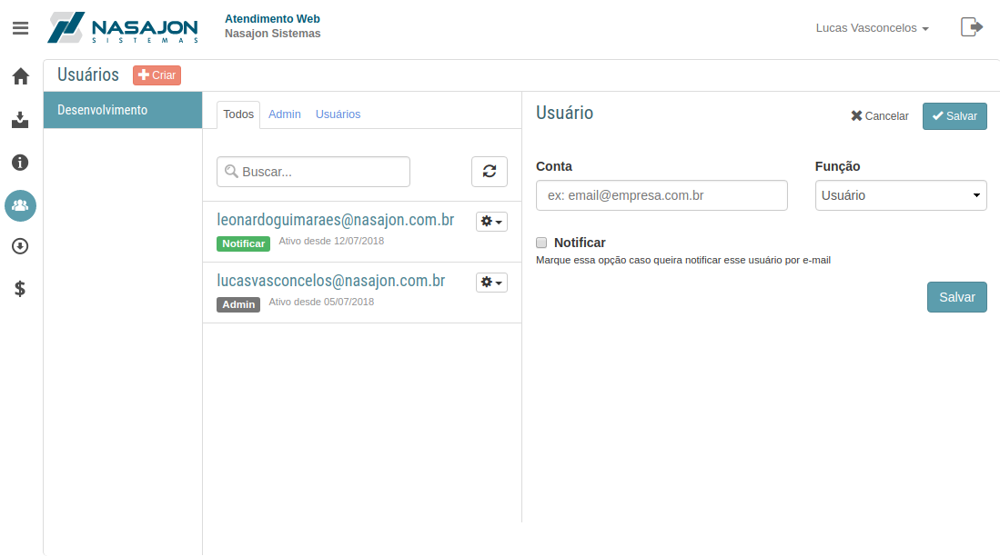

# Usuários
[Voltar](../../../README.md)

Esta sessão tem o objetivo de gerenciar todos os usuários que estão cadastrados no cliente.

* É possível cadastrar novos usuário
* Alterar a função dos usuários
* Deletar usuários

Estes usuários terão permissão de criar chamados em nome do cliente.

------------

[< Base de Conhecimento](artigos.md) - [Downloads >](downloads.md)